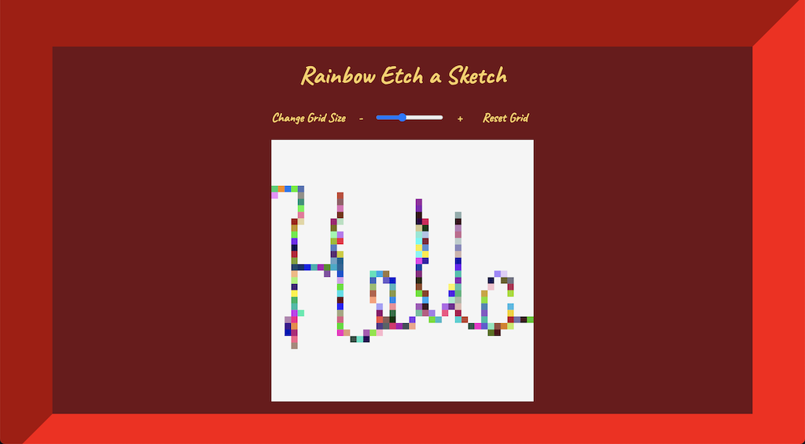

# Etch a Sketch

Live Demo: https://ts-oh.github.io/etch-a-sketch/

## Screenshots

## This is a etch-a-sketch project from 'The Odin Project'

- Used: JavaScript, CSS, and HTML.

- Optional Features:

  - [x] Rainbow coloring on hover added.

### Lessons/Comments

This was a pretty cool project and alot of fun to work on. The hardest challenge was finding out how to dynamically create even fitting div boxes inside the container.
